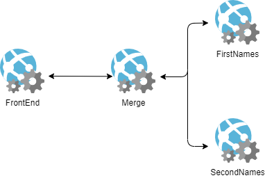
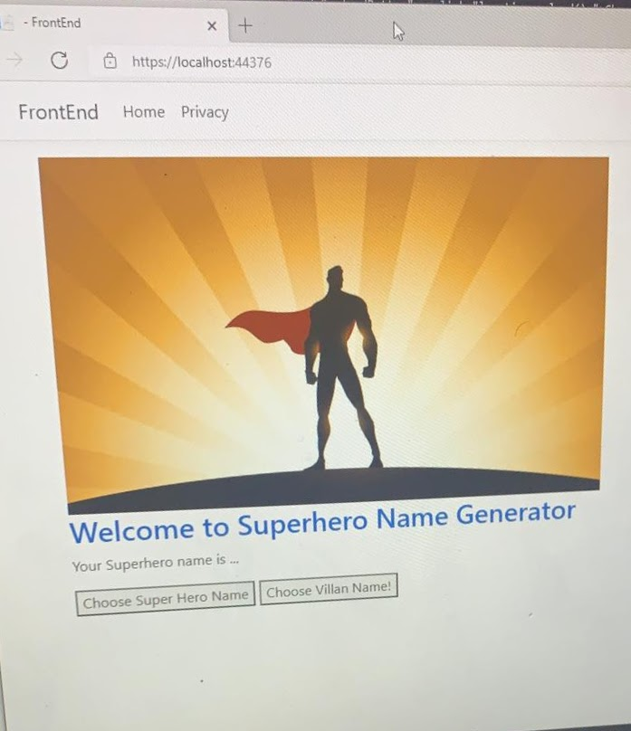

# superhero
Super Hero Name Generator

# Brief
To create a service-oriented application composed of at least 4 services that interact with each other.

More specifically, this will involve:
- Project Management
- C# & ASP.NET
- Unit Testing
- Git
- Terraform
- Ansible
- Continuous Integration
- Cloud Fundamentals
- MySQL (Stretch Goal)
- Front End Development (Stretch Goal)

## Additional requirements and constraints

The application must consist of 4 services that interact with each other.

### Service 1
The core service – this will render the HTML needed to interact with the application, it will also be responsible for communicating with the other 3 services, and finally for persisting some data in an SQL database.

### Service 2 + 3
These will both generate a random “Object” e.g.

Random number
Random letter
Pull an item from an Array
Pull from a .csv
Pull from a database
API call to an external API

### Service 4
This service will also create an “Object” however this “Object” must be based upon the results of service 2 + 3 using some pre-defined rules.

### The following technology must be used:
- Kanban Board: Trello, Jira or an equivalent Kanban Board
- Programming languages: C# & Javascript (Stretch Goal)
- Unit Testing with C#
- Front-end: ASP.NET (Angular as a stretch goal)
- Version Control: Git
- CI Server: Azure DevOps or GitHub Actions
- Cloud server: Azure App Service

# My Approach

To achieve this, I have decided to produce a superhero name generator.

The services will run as follows:

### Service 1

The FrontEnd service will render the HTML needed to interact with the application; the user will land on a welcome page and will be able to choose between whether they want to generate a superhero name or a supervillain name. The result of the Merge service will then be displayed to the user.

### Service 2 + 3 

The FirstNames and SecondNames service will each consist of two arrays of names - one for a superhero and one for a supervillain. FirstNames Service will generate a forename and SecondNames service will generate the second part of the name.

### Service 4

The Merge service will interact with FirstNames and SecondNames services in order to return random a superhero or supervillain name based on the user's selection.

## Setup

If you are to run the code contained in this repository as is, you would need to have the following installed on your computer.

- .NET 5 SDK
- A code editor (Visual Studio or Visual Studio Code)

## Service Architecture

This code contains the following services.

|Service|Azure Resource
|---|---|
Front End App|Azure App Service (Web App)
Merge App |Azure App Service (Web App)
FirstNames App |Azure App Service (Web App)
SecondNames App | Azure App Service (Web App)

# Project tracking

Jira was used for project tracking; here is a link to the board used: shorturl.at/iozD0

The Kanban board is designed so that the various elements of the project would move along the board from left to right as they are worked on and, eventually, completed. Each card under 'Backlog' is an epic/ containing the user stories and associated tasks. 

Each card is colour coded and tagged to easily identify what kind of element it is:
- Yellow is used to indicate epics, user stories, issues relating to FrontEnd Service (1).
- Dark Blue is used to indicate epics, user stories, issues relating to FirstNames Service (2).
- Red is used to indicate epics, user stories, issues relating to SecondNames Service (3).
- Purple is used to indicate epics, user stories, issues relating to Merge Service (4).
- Mint Green is used to indicate epics, user stories, issues relating to Testing and general Debugging.
- Light Blue is used to indicate epics, user stories, issues relating to IaaC and Deployment.

The lists are as follows:
- Backlog: containing epics, their enclosed user stories and tasks.
- Selected for Development: for epics/user stories/issues which have been selected for development - this helps me to see which tasks I am prioritising from the backlog.
- In-Progress: for epics/user stories/tasks for which work has begun with regards to completing tasks.
- Complete: for epics which have been completed fully and deemed functional, fulfilling the enclosed user story.

# Risk assessment

Here is the link to the risk assessment: shorturl.at/aDLV1

## Infrastructure Setup

- Infrastructure was set up using Terraform, including creating the resource group, app services and deploying the apps on app service.
- I was unable to implement Ansible within this project and time constraints.

## Code Deployment

# Known errors
- Although the application was originally fully functional when run locally, towards the end of the project while attempting to correct deployment errors the FrontEnd service no longer ran properly on localhost, although services 2-4 are still running properly with no errors on localhost.

- CI/CD Pipeline through GitHub Actions fails at publishing stage; I ran into a lot of issues with publishing the services on VS and was not able to fix the issues with AZ logins within the time constraints.

# Future improvements
Outside of current errors and upon completion of the original plan for the app, I would like to:
- Integrate a MySQL Database to increase the number of names available.
- Additional HTML/CSS to make the app more visually engaging. 

# Reflections
- What I learned from project

# Authors
Ciarra Balsomo
